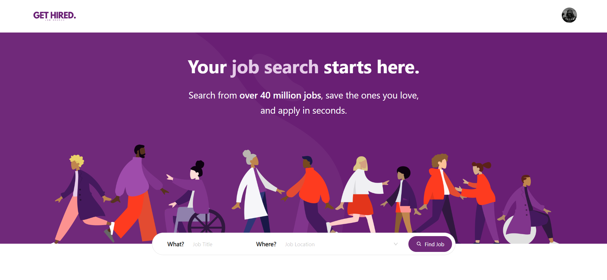
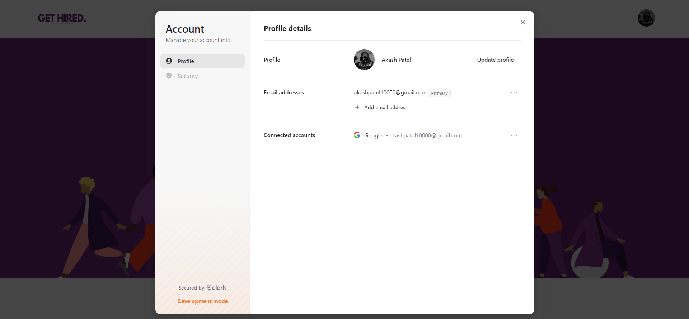
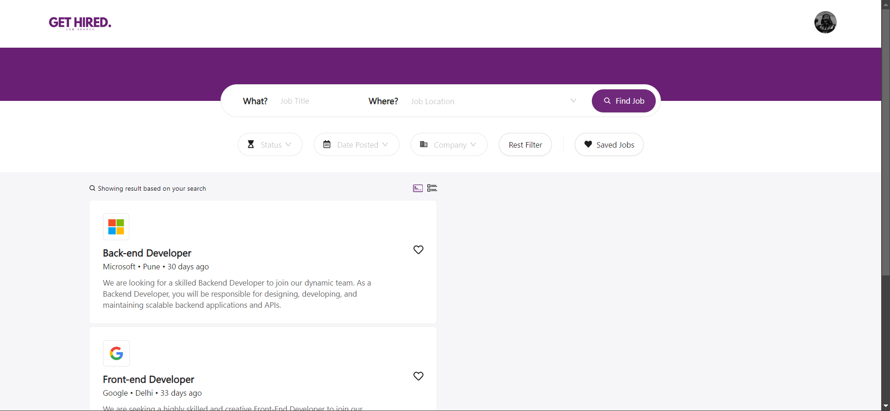
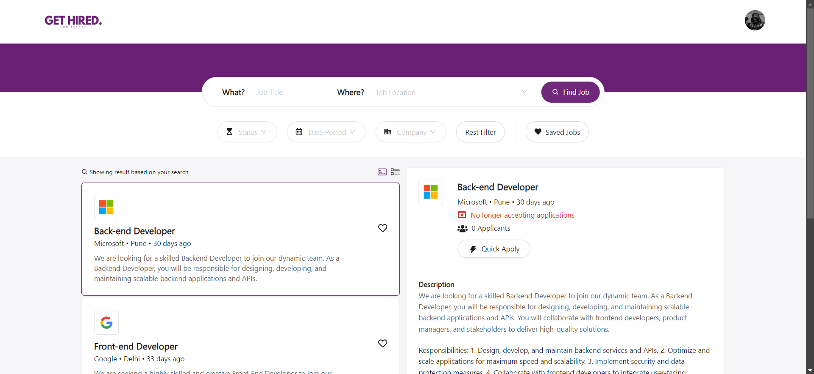
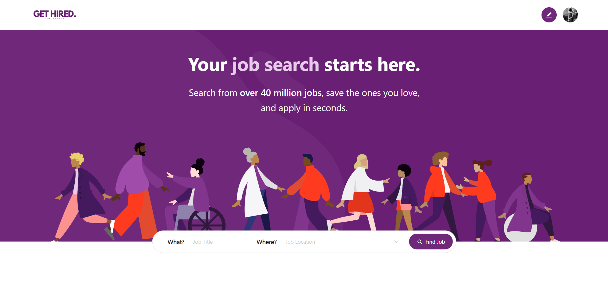
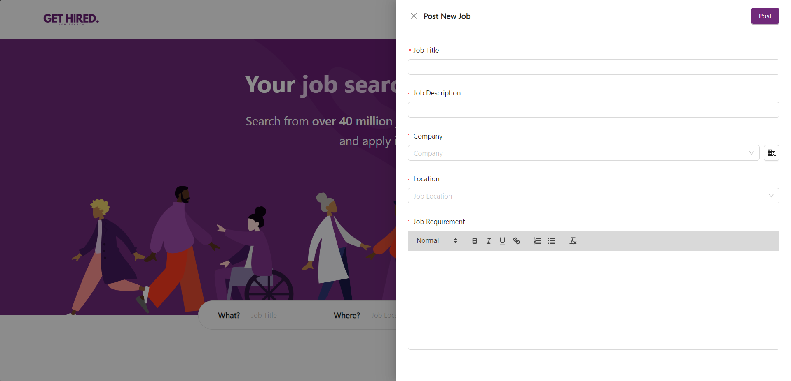
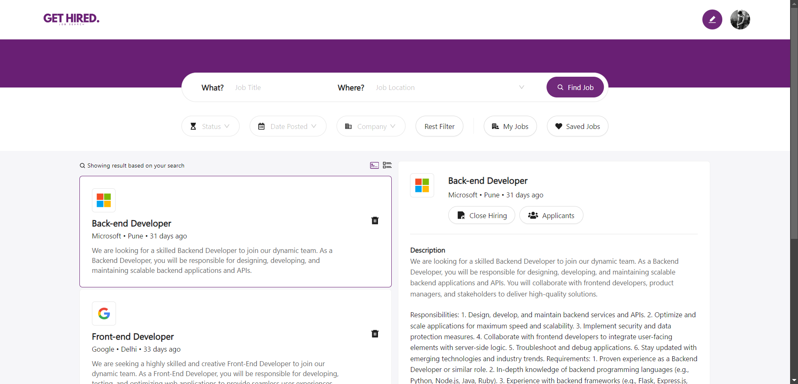
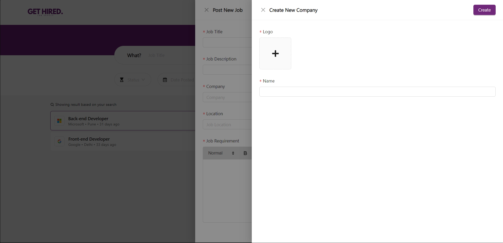

# 🌟 **Get Hired** – Your Gateway to Opportunities


## 🎯 **Project Overview**

Welcome to **Get Hired** – a modern, streamlined platform designed to **empower job seekers** and **recruiters** alike! Whether you're hunting for your dream job or scouting for top talent, **Get Hired** makes it easy, fast, and secure.

🏃‍♂️ **For Job Seekers**: Explore personalized job listings, apply in a single click, and track your applications in real-time!

🏢 **For Recruiters**: Post job openings, manage applications, and connect with the right talent effortlessly.

🔐 **Authentication**: Powered by [Clerk](https://clerk.dev), ensuring secure and seamless logins and registrations.

💾 **Database**: All user and job data is managed with [Supabase](https://supabase.com), providing real-time updates and scalable data handling.

## 🛠 **Tech Stack**

This project leverages the following modern technologies to ensure the best performance and user experience:

| **Frontend** | **Backend** | **Authentication** |
| ------------ | ----------- | ------------------ |
| React + Vite | Supabase    | Clerk              |

- **React + Vite**: Blazing fast frontend framework for a responsive and interactive UI.
- **Supabase**: Secure, scalable backend solution with real-time updates.
- **Clerk**: User authentication that’s easy to implement and maintain.

## 📸 **Project Gallery**

Check out these awesome screenshots showcasing the sleek design and user-friendly interface of **Get Hired**:

**As a Job Seeker**:





**As a recruiter**:





## 🚀 **Getting Started**

Ready to run **Get Hired** locally? Follow these steps to set up your environment:

### ⚙️ **Prerequisites**

Make sure you have these installed on your machine:

- **Node.js** (v14 or higher)
- **npm**
- **Supabase** account & API keys
- **Clerk** account for authentication

### 📝 **Installation Guide**

1. **Clone the repository**:

   ```bash
   git clone https://github.com/your-username/get-hired.git
   cd get-hired
   ```

2. **Install dependencies**:

   ```
   npm install
   ```

3. **Set up environment variables**:

   ```
   VITE_SUPABASE_URL=your-supabase-url
   VITE_SUPABASE_KEY=your-supabase-key
   VITE_CLERK_PUBLISHABLE_KEY=your-clerk-frontend-api
   ```

4. **Run the app**:

   ```
   npm run dev
   ```

🚀 Your app will now be up and running at http://localhost:5173!

## 📧 Contact

If you have any questions, feel free to reach out!

Twitter: [thefstalphabet](https://x.com/thefstalphabet)
Email: akashpatel10000@gmail.com
